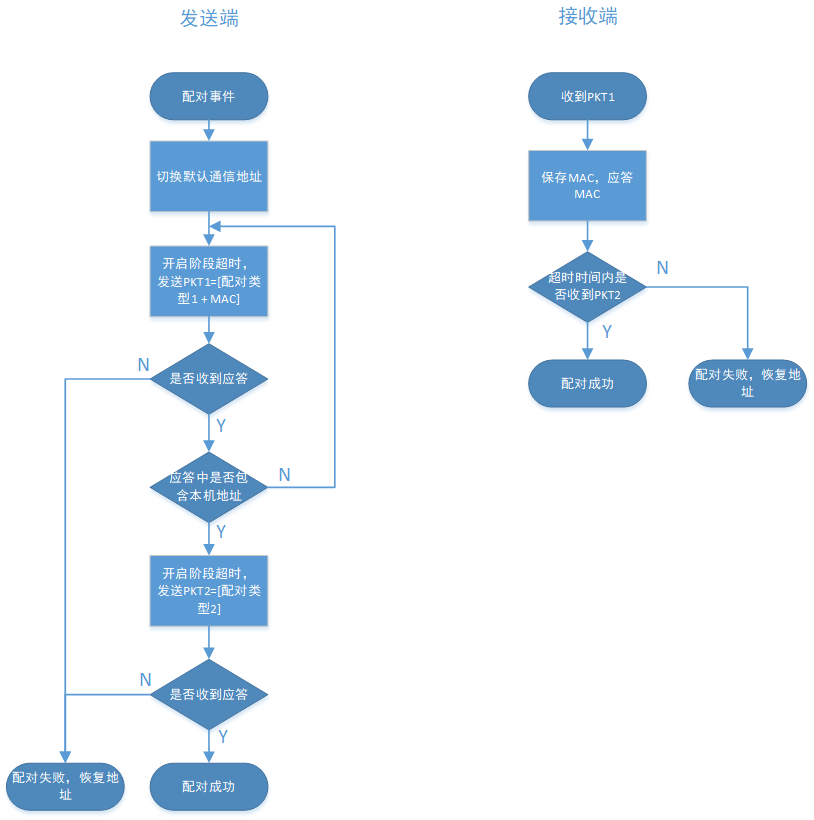

# Three-mode keyboard

[TOC]

------

#### 版本说明

##### firmware

- 环境为沁恒IDE MRS
- Three-mode_kbd为键盘固件，通过定义I2C_LED来选择使用I2C控制背光灯模块还是使用IO控制背光灯，I2C_LED=0对应硬件为WCH-3MDOKBD-R0, I2C_LED=1对应硬件为WCH-3MDOKBD-R1
- Three-mode_kbd_dg为键盘2.4G模式的接收器


##### hardware

**注意：使用ISP工具下载时需取消 RST作为手动复位输入引脚 功能！**
- WCH-3MDOKBD 三模键盘
  - WCH-3MDOKBD-R0-1v0: 初始版本
  - WCH-3MDOKBD-R0-1v1: 添加卫星轴
  - WCH-3MDOKBD-R0-1v2: 调整GPIO连线
  - WCH-3MDOKBD-R1-1v2: 调整GPIO连线，增加背光灯
  - WCH-3MDOKBD-R0-1v3: bug修复
  - WCH-3MDOKBD-R1-1v3: bug修复
- WCH-3MODEKBDDG 三模键盘接收器
  - WCH-3MODEKBDDG-R0-1v0: 初始版本

------

#### 功能概述

- USB
  - USB2.0
  - 支持通用键盘以及位键盘
- BLE
  - BLE 5.1
  - 支持储存4台主机配对信息，热键切换，定向广播回连
- 2.4G
  - 基于MAC地址的配对
  - 支持跳频
- 电源
  - 支持低功耗
  - 支持电源检测

------

#### 技术细节

##### 数据处理基本流程


相关任务接收到扫键任务的消息后，自动读取缓冲区数据，根据数据长度上报数据。

------

##### 数据传输格式

- KEY_BUFFER数据存储格式

  | 键值类型     | ID(1byte) | data(bytes) |
  | ------------ | --------- | ----------- |
  | 多媒体       | 2         | 2 bytes     |
  | 普通键盘键值 | 0         | 8 bytes     |
  | 位键盘键值   | 1         | 16 bytes    |
  | 系统按键     | 3         | 2 bytes     |

- RF数据传输格式

  | 帧格式 | Check_num | MagicWord  | type          | len      | data                                   |
  | ------ | --------- | ---------- | ------------- | -------- | -------------------------------------- |
  | 值     | 0-255     | 0x4B434652 | 配对包/数据包 | data长度 | 配对包：键盘MAC地址 <br />数据包：键值 |

------

##### 任务管理

- HAL_Task

  硬件层任务，初始化硬件层。主要处理低功耗事件，键扫时间，ADC检测事件等。

  - LED_BLINK_EVENT

    点灯事件

  - HAL_KEY_EVENT

    循环事件，周期扫描按键。当键值变化自动写入KEY_BUFFER。单次扫描时间1-2ms。

  - HAL_LOWPOWER_EVENT

    低功耗管理事件，执行后芯片立即shutdown，可通过按键再次唤醒，唤醒后芯片复位。

    当电量低于设定值或者长时间未操作后执行此事件。

  - HAL_ADC_EVENT

    电压监控事件，检测电池电压。当低于2.5V(可调整)后执行HAL_LOWPOWER_EVENT。

    可选择上电仅执行一次，也可定时检测（影响功耗）。

- USB_Task

  USB模块任务，包括USB模块初始化以及IN事件处理。

  - USB_IN_EVT

    USB的IN事务处理事件。USB任务接收到来自HAL_Task的扫键消息时，自动执行此事件。

    此事件会自动读取KEY_BUFFER中数据，填到USB相应端点的DMA中自动上传数据。若数据上传完成后KEY_BUFFER中仍有数据，在短暂延时后会再次执行此事件。

- RF_Task

  2.4G模块任务，包括2.4G模块的初始化，以及配对，跳频处理，数据发送与重发。

  - PAIR_EVENT

    2.4G配对事件，当热键（FN+5）按下后，执行此事件。

    在进行配对后，双方通信地址改为键盘的MAC地址，并开始跳频。

  - RF_SEND_EVENT

    2.4G键值传输事件。RF任务接收到来自HAL_Task的扫键消息时，自动执行此事件。

    此事件会自动读取KEY_BUFFER中数据，填到USB相应端点的DMA中自动上传数据。若数据上传完成后KEY_BUFFER中仍有数据，在短暂延时后会再次执行此事件。

  - RF_RESEND_EVENT

    2.4G重发事件。在RF发送回调函数中，若接收方未收到数据，或者接收数据错误，会触发重发事件。

    重发次数超过5次，键盘进入shutdown模式。

- HIDEmu_Task

  低功耗蓝牙HID设备任务，完成广播连接数据上传等功能。

  - BLE_SEND_DATA_EVT

    BLE键值传输事件。BLE任务接收到来自HAL_Task的扫键消息时，自动执行此事件。

    此事件会自动读取KEY_BUFFER中数据，填到USB相应端点的DMA中自动上传数据。若数据上传完成后KEY_BUFFER中仍有数据，在短暂延时后会再次执行此事件。

------


##### 热键

| 组合键         | 功能                                                         |
| -------------- | ------------------------------------------------------------ |
| Fn+5           | RF模式开启配对                                               |
| Fn+Print-screen      | 切换至蓝牙模式                                               |
| Fn+Scroll-Lock | 切换至2.4G模式                                               |
| Fn+Pause       | 切换至USB模式                                                |
| Fn+1           | 切换至蓝牙主机1（短按：可连接定向广播  长按：可连接非定向广播） |
| Fn+2           | 切换至蓝牙主机2（短按：可连接定向广播  长按：可连接非定向广播） |
| Fn+3           | 切换至蓝牙主机3（短按：可连接定向广播  长按：可连接非定向广播） |
| Fn+4           | 切换至蓝牙主机4（短按：可连接定向广播  长按：可连接非定向广播） |
| Fn+F1          | 静音                                                         |
| Fn+F2          | 降低音量                                                     |
| Fn+F3          | 提高音量                                                     |

------

##### 电源

电源在接入USB时使用USB电源，在未接入USB时使用电池供电。

- 电池电压低于2.5V（可调）时，芯片进入shutdown模式
- 电池电压采用芯片ADC检测
- 检测方式可选择上电检测一次或者定时检测

------

##### RF配对流程



​	键盘按下热键Fn+5开始配对，dongle完成配对后无法接收到其他地址的数据，若要重置dongle，可在上电阶段将UD-接GND。***（tbc）***

------

##### I2C

- 支持主机模式，从机模式
- 支持两种速度模式：100KHz和400KHz，默认400KHz
- 支持7位地址（硬件可支持10位地址）
- 默认I2C FIFO大小32字节

------

##### 外设API

###### keyscan

- 函数名

  ``` c
  bool readKeyVal(void)
  ```

- 参数

  | 参数 | 描述         |
  | ---- | ------------ |
  | 返回 | 键值是否变化 |

###### ringbuffer

*详见[LwRB latest-develop documentation — LwRB documentation (majerle.eu)](https://docs.majerle.eu/projects/lwrb/en/latest/index.html)*

- 初始化缓冲区

  - 函数名

    ``` c
    uint8_t lwrb_init(LWRB_VOLATILE lwrb_t *buff, void *buffdata, size_t size)
    ```

  - 参数

    | param    | description                          |
    | -------- | ------------------------------------ |
    | buff     | Buffer handle                        |
    | buffdata | Pointer to data to write into buffer |
    | size     | Size of `buffdata` in units of bytes |
    | return   | `1` on success, `0` otherwise        |


- 写数据到缓冲区
  - 函数名

    ``` c 
    size_t lwrb_write(LWRB_VOLATILE lwrb_t *buff, const void *data, size_t btw)	
    ```

  - 参数

    | param  | description                          |
    | ------ | ------------------------------------ |
    | buff   | Buffer handle                        |
    | data   | Pointer to data to write into buffer |
    | btw    | Number of bytes to write             |
    | return | Number of bytes written to buffer    |


- 从缓冲区读数据
  - 函数名

    ``` c
    size_t lwrb_read(LWRB_VOLATILE lwrb_t *buff, void *data, size_t btr)
    ```

  - 参数

    | param  | description                                     |
    | ------ | ----------------------------------------------- |
    | buff   | Buffer handle                                   |
    | data   | Pointer to output memory to copy buffer data to |
    | btw    | Number of bytes to read                         |
    | return | Number of bytes read and copied to data array   |


###### dataflash

详见https://github.com/armink/EasyFlash

- 初始化dataflash

  - 函数名

    ``` c
    EfErrCode easyflash_init(void)
    ```

  - 参数

    | param  | description    |
    | ------ | -------------- |
    | return | `0` on success |


- 写入数据到dataflash

  - 函数名

    ``` c
    EfErrCode ef_set_env_blob(const char *key, const void *value_buf, size_t buf_len)
    ```

  - 参数

    | param     | description      |
    | --------- | ---------------- |
    | key       | ENV name         |
    | value_buf | ENV value        |
    | buf_len   | ENV value length |
    | return    | `0` on success   |

  

- 读取dataflash

  - 函数名

    ``` c
    size_t ef_get_env_blob(const char *key, void *value_buf, size_t buf_len, size_t *saved_value_len)
    ```

  - 参数

    | param           | description                                                  |
    | --------------- | ------------------------------------------------------------ |
    | key             | ENV name                                                     |
    | value_buf       | ENV blob buffer                                              |
    | buf_len         | ENV value length                                             |
    | saved_value_len | return the length of the value saved on the flash, 0: NOT found |
    | return          | the actually get size on successful                          |


###### USB 

- IN事务处理

  - 函数名

    ``` c
    bool DevEPn_IN_Deal(void) 
    ```

  - 参数

    | param  | description          |
    | ------ | -------------------- |
    | return | 缓冲区中是否还有数据 |


###### BLE

- 键值上传

  - 函数名

    ``` c
    uint8 HidDev_Report( uint8 id, uint8 type, uint8 len, uint8*pData )
    ```

  - 参数

    | param  | description      |
    | ------ | ---------------- |
    | id     | HID report ID    |
    | type   | HID report type  |
    | len    | Length of report |
    | pData  | Report data      |
    | return | `0` on success   |


- 键值下传(LED指示灯)

  - 函数名

    ```c
    static uint8 hidEmuRcvReport(uint8 len, uint8 *pData) 
    ```

  - 参数

    | param  | description      |
    | ------ | ---------------- |
    | len    | length of report |
    | pData  | report data      |
    | return | status           |

###### RF

- 数据发送

  - 函数名

    ``` c
    bStatus_t myRF_TX(uint8_t *txBuf, uint8_t txLen, bool force)
    ```

  - 参数

    | param  | description                                |
    | ------ | ------------------------------------------ |
    | txBuf  | tx mode tx data                            |
    | txLen  | tx mode tx length(0-251)                   |
    | force  | force sending regardless of sending status |
    | return | `0` on success                             |
  
  
  
- 使能接收

  - 函数名

    ``` c
    bStatus_t RF_Rx( uint8_t *txBuf, uint8_t txLen, uint8_t pktRxType, uint8_t pktTxType )
    ```

  - 参数

    | param     | description                                                  |
    | --------- | ------------------------------------------------------------ |
    | rxBuf     | tx mode tx data                                              |
    | rxLen     | tx mode tx length(0-251)                                     |
    | pktRxType | tx mode tx package type<br/>broadcast type(0xFF):received by all matching types;<br/>others:only received by matching type |
    | pktTxType | tx mode rx package type(auto mode)<br/>broadcast type(0xFF):receive all matching types,<br/>others:receive match type or broadcast type |
    | return    | `0` on success                                               |


- RF配对

  - 函数名

    ``` c
    int Pair_Deal(void )
    ```

  - 参数

    | param  | description                                                  |
    | ------ | ------------------------------------------------------------ |
    | return | `0` on pairing<br />`1 `  on pair success<br />`-1 `  on pair failed |

    

###### I2C

- 初始化

  - 函数名

    ``` c
    void myi2c_Init(void)
    ```


- 关闭I2C

  - 函数名

    ```c
    void twi_disable(void)
    ```

  

- 设置总线地址

  - 函数名

    ``` c
    void twi_setAddress(uint8_t address)
    ```

  - 参数

    | param   | description |
    | ------- | ----------- |
    | address | 总线地址    |

  

- 主机发送

  - 发送初始化

    - 函数名

      ``` c
      void myi2c_beginTransmission(uint8_t address)
      ```

    - 参数

      | param   | description      |
      | ------- | ---------------- |
      | address | 目标从机设备地址 |

  - 发送完成

    - 函数名

      ``` c
      uint8_t myi2c_endTransmission(bool sendStop)
      ```

    - 参数

      | param    | description                                                  |
      | -------- | ------------------------------------------------------------ |
      | sendStop | ` 0` 不产生停止信号<br />`1` 产生停止信号                    |
      | return   | ` 0 ` 发送成功<br />`1` 发送数据长度过长<br />`2` 接收到NACK<br />`3`其他错误，如总线丢失 |

  - 装载数据

    - 函数名

      ``` c
      size_t myi2c_write(uint8_t data)
      ```

    - 参数

      | param  | description                           |
      | ------ | ------------------------------------- |
      | data   | 主机发送数据                          |
      | return | `0` 填入数据失败<br />`1`填入数据成功 |

- 主机接收

  - 数据接收

    - 函数名

      ``` c
      uint8_t myi2c_requestFrom(uint8_t address, uint8_t quantity, uint32_t iaddress, uint8_t isize, uint8_t sendStop)
      ```

    - 参数

      | param    | description                               |
      | -------- | ----------------------------------------- |
      | address  | 目标从机设备地址                          |
      | quantity | 接收数据长度                              |
      | iaddress | 目标从机寄存器地址                        |
      | isize    | 寄存机地址大小                            |
      | sendStop | ` 0` 不产生停止信号<br />`1` 产生停止信号 |
      | return   | 接收字节长度                              |

  - 读取数据

    - 函数名

      ``` c
      int myi2c_read(void)
      ```

    - 参数

      | param  | description    |
      | ------ | -------------- |
      | return | 接收FIFO中数据 |

    > **注**：此函数只能在从机接收回调函数中，或在调用myi2c_requestFrom（）函数后使用。

  

- 从机发送

  - 从机发送回调函数

    - 函数名

      ```c
      void RequestCB(void)
      ```

  - 从机发送队列填充函数

    - 函数名

      ``` c
      uint8_t twi_transmit(const uint8_t* data, uint8_t length)
      ```

    - 参数

      | param  | description                                        |
      | ------ | -------------------------------------------------- |
      | data   | 指向数据数组的指针                                 |
      | length | 数据数组中字节数                                   |
      | return | `0`success<br />`1`数据过长<br />`2`非从机发送模式 |

    > **注**：此函数必须在从机发送事件的回调函数中使用。


- 从机接收

  - 从机接收回调函数

    - 函数名

      ```c
      void ReceiveCB( int len)
      ```

    - 参数

      | param | description      |
      | ----- | ---------------- |
      | len   | 从机接收数据长度 |

  - 从机接收数据读取函数

    - 函数名

      ```c
      int myi2c_read(void)
      ```

    - 参数

      | param  | description    |
      | ------ | -------------- |
      | return | 接收FIFO中数据 |

    > **注**：此函数只能在从机接收回调函数中，或在调用myi2c_requestFrom（）函数后使用。

